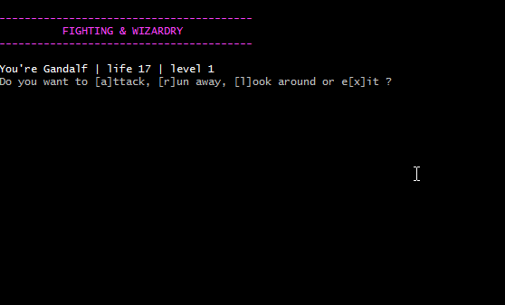

# fighting-and-wizardry

Small text based game (door, monster, loot) in python.

Made for the (great) [Python Jumpstart by Building 10 Apps](https://training.talkpython.fm/courses/details/python-language-jumpstart-building-10-apps)
course of TalkPython, I upgraded the fight system to better reflect a RPG.

First I changed the combat system to take a parry value and an attack value.
I also made the monsters attack the player when an action is done, as in most rpg I played there's a Player turn and a monster one (Or GM one !).
It was also logical to add a Room system, a level and a life one.
I also made cosmetic changes.

## TODO :
* Loot
* More monster variety
* Different Room (hospital..)
* Better athmosphere
